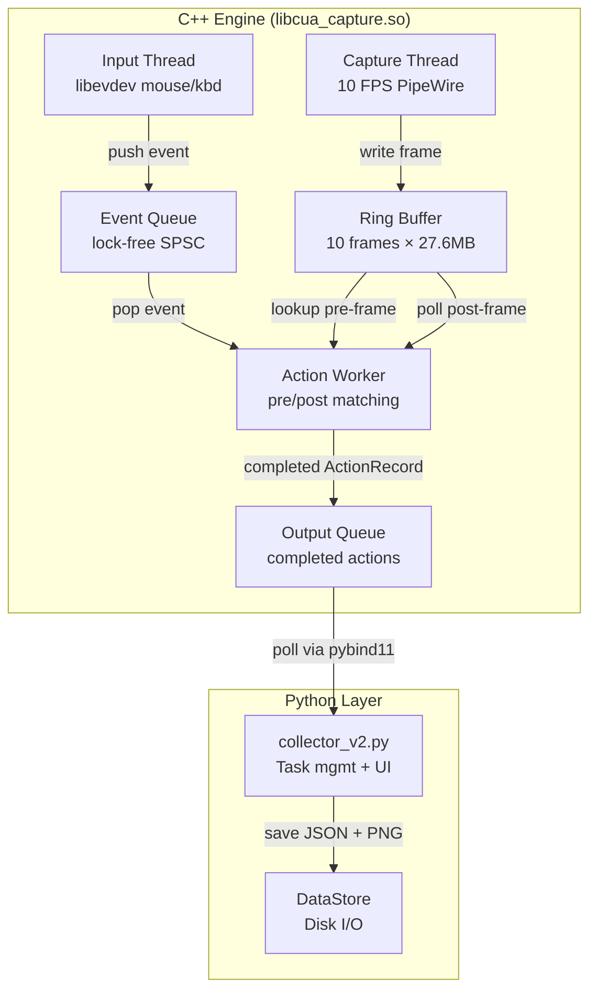
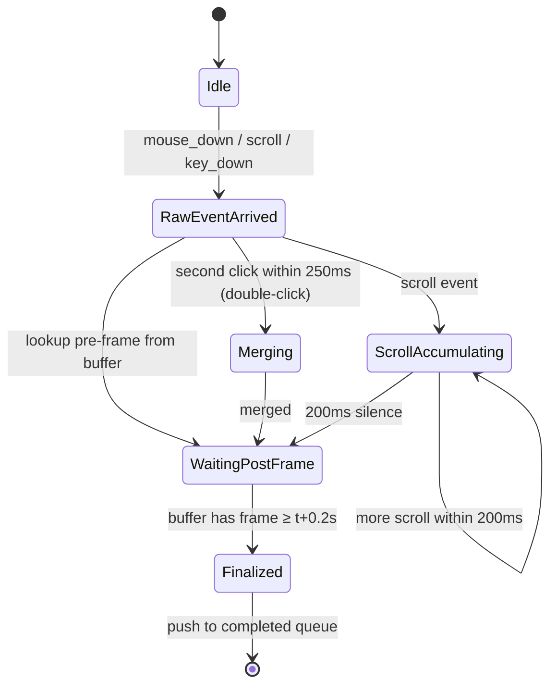

# V2 High-Performance Capture Engine (C++)

Replace the current "screenshot-on-demand" model with a **continuous ring buffer capture + event correlation** engine written in C++, exposed to Python via pybind11.

## Background & Problem

The current V1 collector is fully manual:
- User presses `Ctrl+F9` → screenshot → waits for click → debounce 0.5s → screenshot again
- Each screenshot goes through GJS → GStreamer → PNG encode → disk write
- Latency per capture ≈ 200-500ms (too slow for automated high-frequency capture)

**V2 requirements:**
| Parameter | Value |
|---|---|
| Pre-frame | ≤ `t_event − 0.2s` (the latest frame at least 200ms before the event) |
| Post-frame | ≥ `t_event + 0.2s` (the first frame at least 200ms after the event) |
| Action interval | ~0.5s per action |
| Max resolution | 3840 × 2400 |
| Stress test | 400 clicks (≈ 200 actions) in a row |
| Buffer medium | Memory only (disk writes are async) |

## User Review Required

> [!IMPORTANT]
> **Screenshot capture backend**: PipeWire dev headers are **not installed**. We need `sudo apt install libpipewire-0.3-dev libspa-0.2-dev`. The plan uses PipeWire's C API directly for zero-copy frame acquisition from the portal screencast stream — same underlying mechanism as V1's GJS/GStreamer approach but without the per-frame GStreamer pipeline overhead.

> [!IMPORTANT]
> **Build dependencies to install:**
> ```bash
> sudo apt install libpipewire-0.3-dev libspa-0.2-dev libevdev-dev \
>                  libturbojpeg0-dev libpng-dev libjpeg-turbo8-dev \
>                  pybind11-dev python3-dev cmake
> ```

> [!WARNING]
> **Strategy question**: The current V1 is manual (hotkey-driven). V2 is fully automated (continuous capture). Should V2:
> - **(A)** Be a standalone C++ binary + Python wrapper that replaces the collector entirely?
> - **(B)** Be a C++ library (`.so` via pybind11) that the existing Python collector imports?
> 
> **Plan assumes (B)** — max code reuse. The Python layer keeps hotkey handling, task management, UI overlay, and data export. C++ handles only the hot path: continuous capture → ring buffer → event correlation → frame pairs.

## Architecture



### Thread Model (4 threads)

| # | Thread | Responsibility | Frequency |
|---|--------|---------------|-----------|
| 1 | **Capture** | PipeWire frame → ring buffer | 10 FPS (100ms) |
| 2 | **Input** | libevdev → raw mouse/key events → event queue | Event-driven |
| 3 | **Action Worker** | Consume events, correlate pre/post frames, produce actions | Event-driven |
| 4 | **Python main** | Task mgmt, UI overlay, disk export | Poll at ~20Hz |

## Proposed Changes

### Build System

#### [NEW] [CMakeLists.txt](file:///home/zihan/Documents/Research/CUA_BehaviorClone/V2/CMakeLists.txt)

CMake project producing `cua_capture` Python extension module via pybind11.

```cmake
cmake_minimum_required(VERSION 3.18)
project(cua_capture CXX)
set(CMAKE_CXX_STANDARD 20)

find_package(pybind11 REQUIRED)
find_package(PkgConfig REQUIRED)
pkg_check_modules(PIPEWIRE REQUIRED libpipewire-0.3)
pkg_check_modules(LIBEVDEV REQUIRED libevdev)
pkg_check_modules(TURBOJPEG REQUIRED libturbojpeg)

pybind11_add_module(cua_capture
    src/ring_buffer.cpp
    src/pipewire_capture.cpp
    src/input_monitor.cpp
    src/action_engine.cpp
    src/bindings.cpp
)
target_include_directories(cua_capture PRIVATE
    ${PIPEWIRE_INCLUDE_DIRS} ${LIBEVDEV_INCLUDE_DIRS} ${TURBOJPEG_INCLUDE_DIRS}
    include/
)
target_link_libraries(cua_capture PRIVATE
    ${PIPEWIRE_LIBRARIES} ${LIBEVDEV_LIBRARIES} ${TURBOJPEG_LIBRARIES}
    pthread
)
```

---

### Core Data Structures

#### [NEW] [ring_buffer.h](file:///home/zihan/Documents/Research/CUA_BehaviorClone/V2/include/ring_buffer.h)

Lock-free (single-writer / multi-reader) fixed-capacity ring buffer for frames.

```cpp
struct FrameSlot {
    uint64_t frame_id;         // monotonic counter
    double   timestamp_sec;    // clock_gettime(MONOTONIC)
    int      width, height;
    // RGB pixel data stored inline in a pre-allocated byte vector
    std::vector<uint8_t> rgb_data;  // size = width * height * 3
    bool valid;
};

class RingBuffer {
    std::vector<FrameSlot> slots_;   // fixed capacity (e.g. 10)
    std::atomic<uint64_t> head_;     // next write position
    mutable std::shared_mutex mu_;   // reader/writer lock
public:
    RingBuffer(size_t capacity, int max_w, int max_h);
    
    // Writer (capture thread only)
    FrameSlot& begin_write();      // get next slot to fill
    void commit_write();           // advance head
    
    // Reader (action worker)
    // Find latest frame with ts <= target_ts
    bool find_pre_frame(double target_ts, FrameSlot& out);
    // Find earliest frame with ts >= target_ts  
    bool find_post_frame(double target_ts, FrameSlot& out);
};
```

**Memory budget**: 10 slots × 3840 × 2400 × 3 = **276 MB** (1 second of 10 FPS at full res).

#### [NEW] [ring_buffer.cpp](file:///home/zihan/Documents/Research/CUA_BehaviorClone/V2/src/ring_buffer.cpp)

Implementation — the key is that `find_pre_frame` copies the frame data out under a shared lock (so capture thread doesn't overwrite while we read). The copy of a 27.6 MB frame at memory bandwidth is ~2-3ms, acceptable.

---

### PipeWire Capture

#### [NEW] [pipewire_capture.h](file:///home/zihan/Documents/Research/CUA_BehaviorClone/V2/include/pipewire_capture.h)

```cpp
class PipeWireCapture {
    // Manages the PipeWire screencast session:
    //   1. XDG portal CreateSession/SelectSources/Start via GDBus (reuse GJS for portal setup)
    //   2. Connect to PipeWire with pw_stream
    //   3. On each frame callback: convert to RGB, write to RingBuffer
    
    RingBuffer& buffer_;
    pw_main_loop* loop_;
    pw_stream* stream_;
    bool running_;
    std::thread capture_thread_;
    
public:
    PipeWireCapture(RingBuffer& buffer);
    
    // Start the portal session (may show GNOME share dialog)
    // Returns false if portal denied
    bool init_portal();
    
    // Start capture thread (blocks until stream is flowing)
    void start();
    void stop();
};
```

**Key insight**: Instead of launching a GStreamer pipeline per frame (V1), we keep a persistent `pw_stream` connection. PipeWire delivers frames via callback — we do a format conversion (SPA_VIDEO_FORMAT → RGB) and memcpy into the ring buffer. **Zero disk I/O on the hot path.**

**Portal session setup**: We reuse the existing GJS script approach (same `persist_mode=2`) to get the PipeWire FD + node ID, then pass those to the C++ PipeWire stream. This avoids reimplementing the XDG portal dance in C++.

#### [NEW] [pipewire_capture.cpp](file:///home/zihan/Documents/Research/CUA_BehaviorClone/V2/src/pipewire_capture.cpp)

Implementation:
1. Spawn GJS helper (same script as V1) to get `pw_fd` and `pw_node_id`
2. Create `pw_main_loop` + `pw_stream` with `PW_STREAM_FLAG_AUTOCONNECT`
3. In stream's `process` callback:
   - Map the SPA buffer
   - Convert from SPA format (usually BGRx or RGBA) to RGB
   - Write into `RingBuffer::begin_write()` / `commit_write()`
4. Frame rate control: if frames arrive faster than 10 FPS, skip (just don't write to buffer)

---

### Input Monitoring

#### [NEW] [input_monitor.h](file:///home/zihan/Documents/Research/CUA_BehaviorClone/V2/include/input_monitor.h)

```cpp
enum class RawEventType {
    MOUSE_DOWN, MOUSE_UP,
    KEY_DOWN, KEY_UP,
    SCROLL,
};

struct RawInputEvent {
    RawEventType type;
    double       timestamp_sec;  // CLOCK_MONOTONIC
    int          x, y;           // cursor coords (for mouse events)
    int          button;         // BTN_LEFT/RIGHT/MIDDLE
    int          key_code;       // evdev scancode (for key events)
    int          scroll_dx, scroll_dy;
};

class InputMonitor {
    std::vector<int> fds_;       // evdev file descriptors
    std::thread thread_;
    bool running_;
    
    // Thread-safe queue for raw events
    std::mutex queue_mu_;
    std::deque<RawInputEvent> queue_;
    
    // Cursor position (fetched via CUA extension or gnome-eval)
    std::pair<int,int> get_cursor_position();
    
public:
    InputMonitor();
    void start();
    void stop();
    
    // Called by ActionEngine
    bool pop_event(RawInputEvent& out);
    size_t pending_count();
};
```

#### [NEW] [input_monitor.cpp](file:///home/zihan/Documents/Research/CUA_BehaviorClone/V2/src/input_monitor.cpp)

Uses libevdev to:
1. Scan `/dev/input/event*` for keyboard + mouse devices (same logic as V1's `WaylandInputMonitor`)
2. `select()`/`epoll()` on all device FDs
3. For mouse button press/release: fetch cursor position, push `RawInputEvent`
4. For scroll: push scroll event
5. For key press/release: push key event (modifier tracking for hotkeys)

---

### Action Engine (Core Logic)

#### [NEW] [action_engine.h](file:///home/zihan/Documents/Research/CUA_BehaviorClone/V2/include/action_engine.h)

```cpp
enum class ActionType {
    CLICK, DOUBLE_CLICK, DRAG, SCROLL, HOTKEY, UNKNOWN
};

struct CompletedAction {
    uint64_t    action_id;
    ActionType  type;
    double      event_ts;          // monotonic timestamp of the triggering event
    int         x, y;              // action coordinates
    int         button;            // mouse button
    int         scroll_dx, scroll_dy;
    
    // Frame data (RGB bytes, compressed later by Python)
    uint64_t    pre_frame_id;
    double      pre_frame_ts;
    std::vector<uint8_t> pre_frame_rgb;
    int         pre_w, pre_h;
    bool        pre_degraded;      // true if couldn't find frame ≤ t-0.2s
    
    uint64_t    post_frame_id;
    double      post_frame_ts;
    std::vector<uint8_t> post_frame_rgb;
    int         post_w, post_h;
    
    // Raw sub-events (for drag, double-click decomposition)
    std::vector<RawInputEvent> raw_events;
};

class ActionEngine {
    RingBuffer& buffer_;
    InputMonitor& input_;
    std::thread worker_thread_;
    bool running_;
    
    // Pending actions waiting for post-frame
    struct PendingAction {
        uint64_t    action_id;
        double      event_ts;
        double      required_post_ts;  // event_ts + 0.2
        ActionType  type;
        int         x, y;
        int         button;
        int         scroll_dx, scroll_dy;
        uint64_t    pre_frame_id;
        double      pre_frame_ts;
        std::vector<uint8_t> pre_frame_rgb;
        int         pre_w, pre_h;
        bool        pre_degraded;
        std::vector<RawInputEvent> raw_events;
        double      last_event_ts;     // for grouping (scroll burst, etc.)
    };
    std::vector<PendingAction> pending_;
    
    // Completed actions queue (polled by Python)
    std::mutex output_mu_;
    std::deque<CompletedAction> completed_;
    
    // Grouping parameters
    static constexpr double DOUBLE_CLICK_MAX_INTERVAL = 0.250;  // seconds
    static constexpr double DOUBLE_CLICK_MAX_DISTANCE = 8.0;    // pixels
    static constexpr double SCROLL_MERGE_WINDOW = 0.200;        // seconds
    static constexpr double PRE_FRAME_OFFSET = 0.200;           // seconds
    static constexpr double POST_FRAME_OFFSET = 0.200;          // seconds
    
    void worker_loop();
    void process_event(const RawInputEvent& ev);
    void check_pending_completions();
    
public:
    ActionEngine(RingBuffer& buffer, InputMonitor& input);
    void start();
    void stop();
    
    // Python interface
    bool pop_completed(CompletedAction& out);
    size_t completed_count();
};
```

#### [NEW] [action_engine.cpp](file:///home/zihan/Documents/Research/CUA_BehaviorClone/V2/src/action_engine.cpp)

**State machine per action lifecycle:**



**Worker loop** (runs at ~100Hz poll):
```
while running:
    // 1. Drain new events from InputMonitor
    while input.pop_event(ev):
        process_event(ev)
    
    // 2. Check all pending actions for post-frame availability
    check_pending_completions()
    
    // 3. Sleep 5-10ms to avoid busy-wait
    sleep(10ms)
```

**process_event logic:**
- `MOUSE_DOWN`: Record timestamp, coords. Wait for `MOUSE_UP` to determine click vs drag.
- `MOUSE_UP`: 
  - If delta from down pos > 3px or hold time > 0.3s → `DRAG`
  - Else check if previous action was also a click within 250ms + 8px → merge into `DOUBLE_CLICK`
  - Otherwise → `CLICK`
  - Lookup pre-frame: `buffer.find_pre_frame(event_ts - 0.2)`. If none, use earliest available + set `pre_degraded=true`
  - Create `PendingAction` with `required_post_ts = event_ts + 0.2`
- `SCROLL`: Start or extend scroll accumulator. On 200ms timeout → finalize scroll action.
- `KEY_DOWN/UP`: Track modifiers. Hotkey detection (Ctrl+F8/F9/F12) handled separately via callback.

**check_pending_completions:**
```
for each pending in pending_:
    if buffer.find_post_frame(pending.required_post_ts, frame):
        // Complete the action
        completed.push(make_completed(pending, frame))
        remove from pending_
```

---

### Python Bindings

#### [NEW] [bindings.cpp](file:///home/zihan/Documents/Research/CUA_BehaviorClone/V2/src/bindings.cpp)

pybind11 module exposing:
```python
import cua_capture

engine = cua_capture.CaptureEngine()
engine.init_portal()       # shows GNOME share dialog if needed
engine.start()             # starts capture + input threads

# Poll for completed actions
while True:
    action = engine.pop_action()  # returns None if empty
    if action:
        # action.pre_frame_rgb  → bytes (RGB)
        # action.post_frame_rgb → bytes (RGB)  
        # action.type           → "click" / "double_click" / "drag" / "scroll"
        # action.x, action.y    → coordinates
        # action.event_ts       → float (monotonic)
        # action.pre_degraded   → bool
        save_to_disk(action)
    time.sleep(0.05)

engine.stop()
```

Key bindings:
- `CompletedAction` → Python dict with `pre_frame_rgb` as `bytes`, `post_frame_rgb` as `bytes`
- Frame RGB data transferred as Python `bytes` (zero-copy via pybind11 buffer protocol)
- Python side does PIL `Image.frombytes("RGB", (w,h), data)` → `.save("path.png")`

---

### Python Integration

#### [NEW] [collector_v2.py](file:///home/zihan/Documents/Research/CUA_BehaviorClone/V2/collector_v2.py)

Thin Python wrapper that:
1. Imports `cua_capture` C++ module
2. Reuses existing `DataStore`, `StatusOverlay`, `TaskRecord`, `ActionRecord` from V1
3. Handles hotkey detection (Ctrl+F8/F9/F12 are forwarded from C++ InputMonitor via callback)
4. Polls `engine.pop_action()` at ~20Hz
5. Converts RGB bytes → PIL Image → PNG file on disk (async thread pool)
6. Writes `task.json` / `index.json`

The key difference from V1: **no manual Ctrl+F9 step**. Actions are captured automatically while a task is active.

Workflow:
```
Ctrl+F8 → start task → engine.start()
  [actions are auto-captured continuously]
  [Python polls completed actions, saves to disk]
Ctrl+F12 → end task → engine.stop()
```

---

### Benchmark / Test

#### [NEW] [benchmark.cpp](file:///home/zihan/Documents/Research/CUA_BehaviorClone/V2/tests/benchmark.cpp)

Standalone C++ test that measures:
1. Ring buffer write throughput (10 FPS, 3840×2400×RGB)
2. Ring buffer lookup latency (`find_pre_frame`, `find_post_frame`)
3. Simulated 400-click stress test (synthetic events at 0.5s interval, verify all actions matched)
4. Memory usage (RSS)

#### [NEW] [test_stress.py](file:///home/zihan/Documents/Research/CUA_BehaviorClone/V2/tests/test_stress.py)

Python integration test:
1. Start engine
2. Simulate 200 actions at 0.5s intervals
3. Verify all 200 actions have valid pre/post frames
4. Verify pre_frame_ts ≤ event_ts − 0.2 and post_frame_ts ≥ event_ts + 0.2
5. Report timing statistics

---

## File Tree

```
V2/
├── CMakeLists.txt
├── include/
│   ├── ring_buffer.h
│   ├── pipewire_capture.h
│   ├── input_monitor.h
│   └── action_engine.h
├── src/
│   ├── ring_buffer.cpp
│   ├── pipewire_capture.cpp
│   ├── input_monitor.cpp
│   ├── action_engine.cpp
│   └── bindings.cpp
├── tests/
│   ├── benchmark.cpp
│   └── test_stress.py
├── collector_v2.py          # Python entry point
└── build/                   # CMake build dir (gitignored)
```

## Memory Budget (3840×2400)

| Component | Size |
|---|---|
| Ring buffer (10 frames × RGB) | 10 × 27.6 MB = **276 MB** |
| Pending actions (max ~5 concurrent) | 5 × 27.6 MB × 2 = **276 MB** (pre-frame copies) |
| Event queue | < 1 MB |
| **Total** | **~552 MB worst case** |

On your 30 GB system this is <2% of RAM. Acceptable.

> [!TIP]
> If we want to reduce memory, we can JPEG-compress frames in the ring buffer (libturbojpeg). A 3840×2400 frame at quality 90 ≈ 2-4 MB. This would drop total buffer to ~40 MB. But adds ~5ms encode latency per frame. Can be added as a follow-up optimization.

## Open Questions

> [!IMPORTANT]
> 1. **Portal reuse**: Should V2 reuse the same GJS portal script from V1 to get the PipeWire FD, or should we implement the XDG portal dance in C++ (more complex, but one fewer subprocess)? **Plan assumes: reuse GJS.**

> [!IMPORTANT]
> 2. **Cursor position source**: V1 uses the `cursor-tracker@cua` GNOME extension (gdbus call). In V2, the C++ input thread only gets `libevdev` events (relative mouse moves, no absolute position). Should we:
>    - **(A)** Call the CUA extension from C++ via D-Bus (libgio/libdbus)
>    - **(B)** Keep a Python callback for cursor position queries
>    - **(C)** Track mouse position in C++ by accumulating relative moves from evdev (less accurate, needs initial calibration)
>    
>    **Plan assumes (A)** — direct GDBus calls from C++. Adds `libgio-2.0` dependency but cleanest approach.

> [!IMPORTANT]
> 3. **Hotkey handling**: Should hotkeys (Ctrl+F8/F9/F12) be:
>    - Detected in C++ and signaled to Python via callback?
>    - Left entirely in Python (separate pynput/evdev listener)?
>    
>    **Plan assumes**: C++ detects hotkeys in the input thread and exposes them via a poll-able queue to Python, similar to `pop_action()`.

## Verification Plan

### Automated Tests

1. **C++ unit test** (`benchmark.cpp`):
   ```bash
   cd V2/build && cmake .. && make && ./benchmark
   ```
   - Verify ring buffer correctness under concurrent read/write
   - Measure frame write latency < 5ms
   - Measure pre/post lookup latency < 1ms
   - Simulate 400-click stress test, verify 0 missed actions

2. **Python integration test** (`test_stress.py`):
   ```bash
   cd V2 && python tests/test_stress.py
   ```
   - Start real PipeWire capture
   - Generate synthetic mouse events via `xdotool` or `evemu-event`
   - Verify all actions captured with valid pre/post frames
   - Check timing constraints: `pre_ts ≤ event_ts - 0.2`, `post_ts ≥ event_ts + 0.2`

### Manual Verification

- Run `collector_v2.py`, start a task, perform rapid clicks (~2/sec) for 30 seconds
- Verify captured PNG pairs visually show correct before/after states
- Monitor `htop` during stress test: RSS should be < 600MB, CPU < 30% for capture thread
